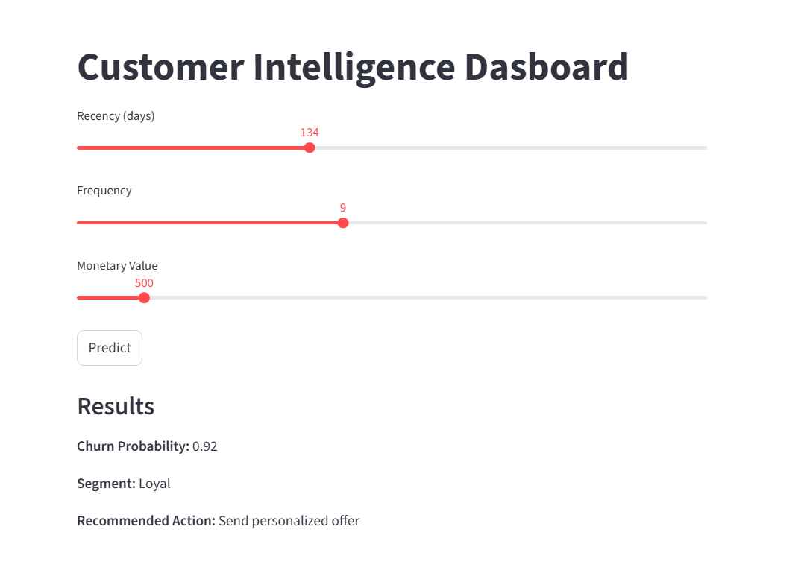

# 🚀 Customer Intelligence & Revenue Optimization System

## 📌 Overview

An end-to-end **Data Science & MLOps project** that predicts customer churn, segments customers using RFM analysis, and recommends business actions to maximize revenue.

This project simulates a real-world system where machine learning is used not just for prediction, but for **decision-making and business impact**.

---

## 🎯 Problem Statement

Businesses often struggle to:

* Identify customers likely to churn
* Segment customers effectively
* Take data-driven actions to retain users

This system solves these problems by combining **ML + Business Logic + Deployment**.

---

## 🔥 Key Features

* 📊 **RFM Analysis** (Recency, Frequency, Monetary)
* 🤖 **Churn Prediction Model** (Random Forest)
* 👥 **Customer Segmentation** (K-Means Clustering)
* 🧠 **Decision Engine** (Action recommendations)
* ⚡ **FastAPI Backend** (Production-ready API)
* 🌐 **Streamlit Dashboard** (Interactive UI)
* 🐳 **Dockerized Application**
* 🔁 **CI/CD with GitHub Actions**

---

## 🧠 Tech Stack

* **Languages**: Python
* **Libraries**: Pandas, NumPy, Scikit-learn
* **ML Models**: Random Forest, K-Means
* **Backend**: FastAPI
* **Frontend**: Streamlit
* **DevOps**: Docker, GitHub Actions
* **Deployment**: Streamlit Cloud (UI)

---

## 🏗️ Project Architecture

User → Streamlit Dashboard → (FastAPI API) → ML Model → Decision Engine → Output

> Note: Currently deployed with Streamlit for demonstration. API is modular and can be integrated for full production setup.

---

## 📊 Dashboard Preview



---

## 🚀 Live Demo

👉 Streamlit App: https://customer-intelligence-revenue-optimization-system-tkmfa7ar4ekz.streamlit.app/

---

## 📦 Installation & Setup

### 1. Clone Repository

```bash
git clone https://github.com/your-username/customer-intelligence-system.git
cd customer-intelligence-system
```

---

### 2. Install Dependencies

```bash
pip install -r requirements.txt
```

---

### 3. Run API (Optional)

```bash
uvicorn app.main:app --reload
```

---

### 4. Run Dashboard

```bash
streamlit run dashboard/streamlit_app.py
```

---

## 📡 API Usage (Optional)

```bash
curl -X POST "http://127.0.0.1:8000/predict" \
-H "Content-Type: application/json" \
-d '{"recency": 100, "frequency": 2, "monetary": 300}'
```

---

## 💡 Example Output

```json
{
  "churn_probability": 0.82,
  "segment": "At Risk",
  "action": "Send reminder email"
}
```

---

## 📈 Business Impact

This system helps businesses:

* Reduce customer churn
* Identify high-value customers
* Take targeted retention actions
* Maximize revenue through data-driven decisions

---

## 🧠 Key Learnings

* End-to-end ML system design
* Feature engineering using RFM
* Handling real-world data issues
* Model deployment using FastAPI
* CI/CD automation
* Building decision-driven ML systems

---

## 🔮 Future Improvements

* Integrate FastAPI with Streamlit (full pipeline)
* Add MLflow for experiment tracking
* Add DVC for data versioning
* Implement model monitoring

---

## 👨‍💻 Author

Hitesh Binjrawat
[https://github.com/Hitesh-Binjrawat]
[https://www.linkedin.com/in/hitesh-binjrawat-2b5226248/]

---
